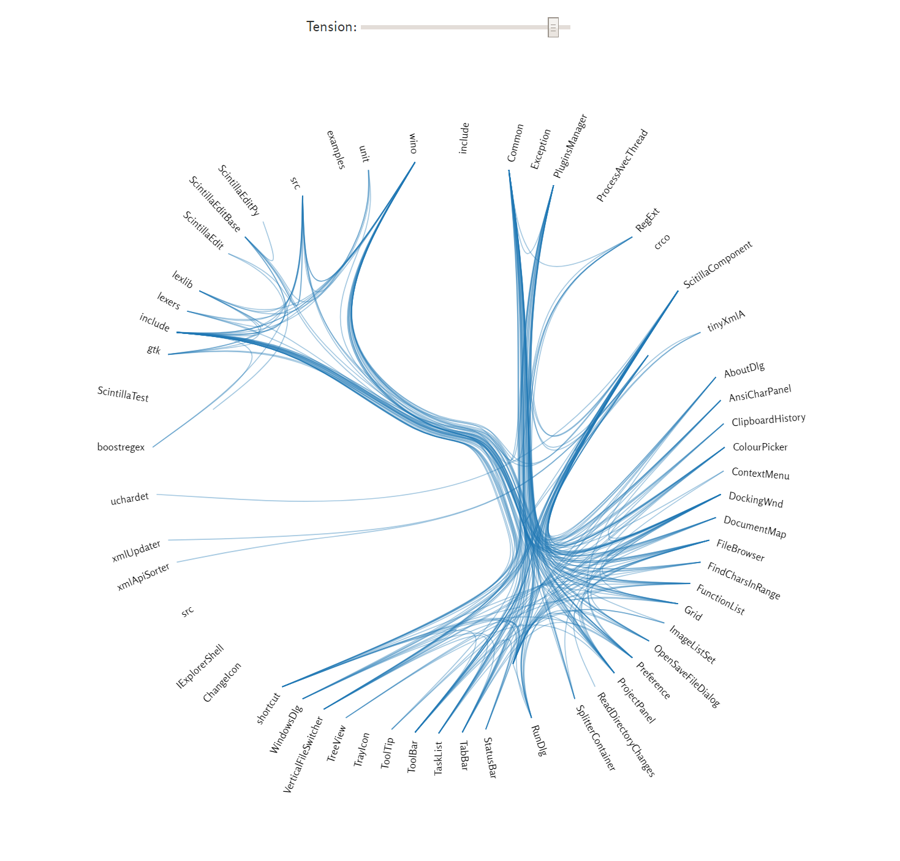

# dependencybundler
Visualize dependencies using a Hierarchical Edge Bundle diagram.

# usage

1. Run the tool ...
2. Put the metrics in a csv file and place the csv file in the same directory as the html file.
3. Start a web server: `python -m http.server 8000`
4. In your browser goto `localhost:8000`

# example output

